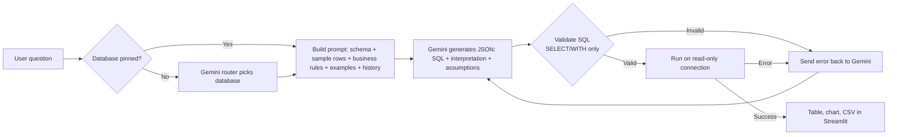

# 🤖 Text-to-SQL Agent
# 🗄️ NL2SQL — Ask Your Database in Plain English

Turn natural-language questions into safe, read-only SQL using **Google Gemini**, run them across **multiple databases**, and explore the results in a **Streamlit** chat interface.

> "Which product categories have a return rate above the overall average?"
> → Gemini writes the SQL → the app runs it → you get a table, a chart and a CSV download.

---

## ✨ Features

- **Multi-database support** – three sample databases (e-commerce, HR, hospital) with automatic question routing, or pin one manually.
- **Handles complex questions** – joins, CTEs, window functions (`RANK`, `LAG`), anti-joins, ratios, top-N-per-group and period-over-period analysis.
- **Prompt engineering built in** – live schema + sample rows, per-database business rules, dialect notes, few-shot examples and a structured JSON response.
- **Self-correcting** – if the generated SQL fails, the error is sent back to Gemini for a fix (up to 2 retries).
- **Safe by design** – read-only database connection, `SELECT`/`WITH`-only validation, single-statement enforcement, row cap.
- **Follow-up questions** – short conversation memory (*"now only for Bengaluru"*).
- **Transparent** – shows the interpretation, assumptions and generated SQL for every answer.
- **Streamlit UI** – chat interface, schema viewer, example questions, CSV export, quick bar charts.
- **Realistic data** – thousands of generated rows with meaningful patterns, reproducible via a fixed random seed.

---

## 🏗️ How It Works



---

## 📁 Project Structure

```
nl2sql_project/
├── app.py               # Streamlit chat UI
├── nl2sql.py            # Engine: routing, schema introspection, Gemini calls, validation, execution
├── prompts.py           # Database registry, business rules, few-shot examples, prompt builders
├── seed_databases.py    # Generates the three sample SQLite databases
├── requirements.txt
├── .env.example         # Template for your API key
└── databases/           # Created by seed_databases.py (git-ignored)
    ├── ecommerce.db
    ├── hr.db
    └── hospital.db
```

---

## 🗃️ Sample Databases

| Database | Tables | Scale |
|---|---|---|
| **ecommerce** | `customers`, `categories` (2-level tree), `products`, `orders`, `order_items`, `reviews`, `product_returns` | ~800 customers, 6,000 orders, ~10,000 line items |
| **hr** | `departments`, `employees` (manager hierarchy), `salary_history`, `projects`, `project_assignments`, `leave_requests`, `performance_reviews` | 300 employees, 40 projects, 1,000 leave requests |
| **hospital** | `doctors`, `patients`, `appointments`, `diagnoses`, `medicines`, `prescriptions`, `billing` | 1,500 patients, 8,000 appointments |

All currency values are in INR.

---

## 🚀 Getting Started

### Prerequisites
- Python 3.9+
- A Gemini API key from [Google AI Studio](https://aistudio.google.com/)

### 1. Clone and create a virtual environment

```bash
git clone https://github.com/<your-username>/<your-repo>.git
cd <your-repo>
```

**Windows (PowerShell)**
```powershell
python -m venv venv
venv\Scripts\activate
```

**macOS / Linux**
```bash
python3 -m venv venv
source venv/bin/activate
```

### 2. Install dependencies
```bash
pip install -r requirements.txt
```

### 3. Configure your API key
Copy `.env.example` to `.env` and add your key:
```env
GEMINI_API_KEY=your-real-key-here
# Optional: choose a different model
# GEMINI_MODEL=gemini-3.6-flash
```

### 4. Create the sample databases
```bash
python seed_databases.py
```

### 5. Run the app

**Streamlit UI**
```bash
streamlit run app.py
```
Open http://localhost:8501.

**Or the command-line version** (set `GEMINI_API_KEY` in your shell first)
```bash
python nl2sql.py
```

---

## 💬 Example Questions

**E-commerce**
- Top 5 customers by total spend in 2025 with their city
- Show month-over-month revenue growth for 2025
- Which product categories have a return rate above the overall average?
- What is the best-selling product in each parent category?
- Which customers ordered in 2024 but not in 2025?

**HR**
- Which active employees earn more than their department average?
- What was the attrition rate per department in 2024?
- Find employees allocated more than 100% across active projects
- Which departments have the highest average salary growth over the last 3 years?

**Hospital**
- Which 5 doctors have the highest no-show percentage?
- Total outstanding balance by insurance provider
- Most prescribed medicine for each severe diagnosis
- For repeat patients, what's the average number of days between visits?

---

## 🧠 Prompt Design

The system prompt (built in `prompts.py`) contains:

1. **Role and date** – senior analyst persona plus today's date for relative-date questions.
2. **Schema** – `CREATE TABLE` statements and sample rows, auto-introspected from the live database.
3. **Business definitions** – e.g. *revenue excludes cancelled orders*, *no-show rate excludes future appointments*.
4. **Dialect notes** – SQLite, PostgreSQL and MySQL hints.
5. **Reasoning checklist** – grain awareness (avoid double-counting joins), CTEs, window functions, anti-joins, safe division with `NULLIF`, half-open date ranges.
6. **Output rules** – one read-only statement, no invented columns, no `SELECT *`, clear aliases, sensible `LIMIT`.
7. **Few-shot examples** – verified queries per database.
8. **Conversation history** – for follow-up questions.
9. **JSON response format** – `interpretation`, `assumptions`, `sql`, `confidence`, `needs_clarification`, `clarification_question`.

---

## ➕ Adding Your Own Database

Add one entry to `DB_REGISTRY` in `prompts.py`:

```python
"my_db": {
    "path": "databases/my_db.db",
    "dialect": "sqlite",
    "description": "What this database contains, in one or two sentences.",
    "business_rules": [
        "Define your KPIs and status values here (this fixes most wrong answers).",
    ],
    "examples": [
        {"question": "A typical question", "sql": "SELECT ..."},
    ],
},
```

Then add example questions to `EXAMPLES` in `app.py` if you want sidebar shortcuts.

**Using PostgreSQL or MySQL?** Only three functions in `nl2sql.py` are SQLite-specific: `get_connection()`, `get_schema_text()` and `run_query()`. Swap them for your driver (e.g. `psycopg2`, `SQLAlchemy`), use a read-only database user, and set `"dialect"` accordingly.

---

## 🔒 Security Notes

- Queries run on a connection opened in **read-only mode** – the database itself rejects writes.
- Generated SQL must be a single `SELECT` or `WITH` statement; DDL/DML keywords are blocked.
- Results are capped at 200 rows.
- Never commit your `.env` file. For production, use a read-only DB user and add authentication, rate limiting and query timeouts.
- Question text and schema/sample rows are sent to the Gemini API. Don't use sensitive production data without reviewing your data-handling requirements.

---

## 🧰 Tech Stack

Python · Google Gemini (`google-genai`) · Streamlit · SQLite · pandas · python-dotenv
